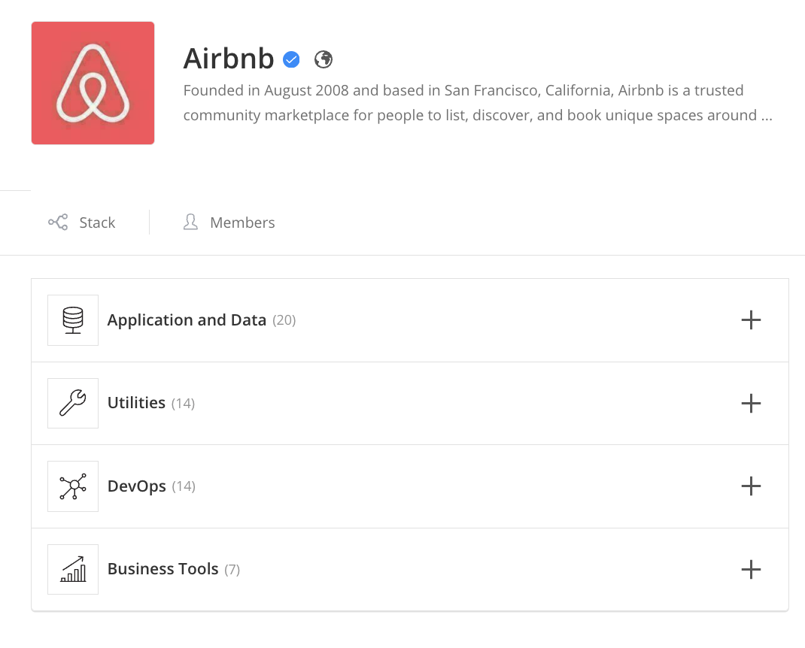
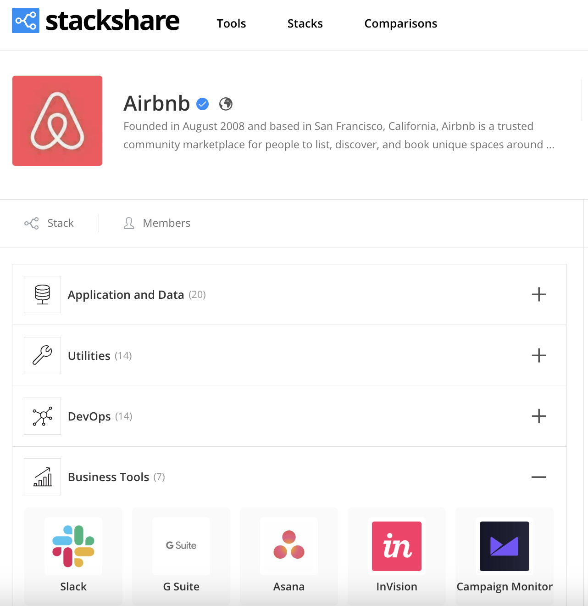

# 🏗️ PropStack Challenge: Build the Future of PropTech Mapping
[](https://github.com/GitD3-png/propstack-challenge/discussions)

Are you ready to build something real that could shape the PropTech industry?
We’re launching the **PropStack Project**, a **PropTech coding challenge** where developers compete to create a live, interactive tech stack manager — inspired by [StackShare.io](https://stackshare.io/stacks) — but designed for the **real estate vertical**.

This competition focuses on **Multifamily** (“Apartments” or “Flats”) as the first asset class, with scope to expand across the PropTech ecosystem.

---

## 💡 The Challenge

Build a full-stack web application that visually maps out the technology companies used in the **Multifamily** real estate industry. Think of it like [StackShare.io](https://stackshare.io/stacks), but specifically designed for real estate asset classes.

- A dynamic dropdown system:
  - **Multifamily → Node (e.g., Occupancy) → Sub-Category (e.g., Move In) → Tag (e.g., Tenant Tech Package)**
- Display company cards (logo + name + link) for each selected sub-category
- Collapse all unrelated paths when one tag is selected
- Back-end support for editing and expanding the tech list (can be no-code or custom CMS)
- Clean, intuitive UX inspired by StackShare.io
- Color palette to be taken from [PTAG](https://www.proptechangelgroup.com/) 

---

## 🏆 Prize

**💰 First Place:** $500 USD + featured on our developer platform

**Top participants** may be invited to join our developer pool for client-facing work

---

## 🛠 Tech Expectations

- Full-stack web application (frontend + backend)
- Clean, modular code
- Intuitive UI with collapsible navigation
- Backend must support adding/editing tech stacks
- Bonus points for:
  - Clean design
  - Efficient data handling
  - CMS integration

---

### 📂 Updated JSON Structure

Here's the updated JSON file used in this project:

[`assets/PropStack_MF_Updated_Structure_Links.json`](./assets/PropStack_MF_Updated_Structure_Links.json)

This file now contains:

- The complete `Multifamily → Area → Segment → Sub-category` hierarchy
- A list of companies under each sub-category with:
  - `name`
  - `url`
  - `logo` (currently a placeholder)
- Navigational references like `"See CRMs"` are now formatted as:
  ```json
  { "see": "CRMs" }
---

## 📤 Submission Instructions

To participate, please submit:
1. A link to your GitHub repo
2. A live demo (or screen recording)
3. A short explanation (in `README` or video):
   - Your structure and approach
   - How to run it locally
   - Any special tools or frameworks used

📩 Submit your project here: [Submit via Google Form](https://forms.gle/xAvVoaoLCfxABx5w9)

---

## 📅 Timeline

- **Launch Date:** 25th March 2025
- **Submission Deadline:** **Monday, 31st March 2025
- **Winner Announced:** TBD

---

## 🧠 Inspiration

We’re inspired by platforms like [StackShare.io](https://stackshare.io/stacks) that organize tools by category and use case.

Here’s an example of the experience we're reimagining for real estate:





---

## 📬 Questions?

Reach out to us at [Demetri@blkhwk.com] or DM via LinkedIn.

Happy building,  
**– The PTAG Team**

---

## 📄 License

The contents of this repository are licensed under the [Creative Commons Attribution-NonCommercial 4.0 International License](https://creativecommons.org/licenses/by-nc/4.0/).

You are free to use and adapt the data and challenge materials for personal or educational purposes. Commercial use is not permitted.
